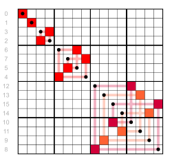

# ReadMe

本项目是本人理解格雷码与BCD编码之间转换算法之后写的一个Qt小程序。BCD转换到格雷码按照定义来就好，没有什么好优化的。但是格雷码到BCD码有多种算法可以讨论。

##  Gray Code（格雷码）

- $G_n$ is a [permutation](https://en.wikipedia.org/wiki/Permutation) of the numbers 0, ..., $2^n − 1$. (Each number appears exactly once in the list.)
- $G_n$ is embedded as the first half of $G_n+1$.
- Therefore, the coding is *stable*, in the sense that once a binary number appears in *$G_n$* it appears in the same position in all longer lists; so it makes sense to talk about *the* reflective Gray code value of a number:$G(m) $= the **m**-th reflecting Gray code, counting from 0.
- Each entry in $G_n$ differs by only one bit from the previous entry. (The Hamming distance is 1.)
- The last entry in $G_n$ differs by only one bit from the first entry. (The code is cyclic.)

the *$n$*th Gray code is obtained by computing ${\displaystyle n\oplus \lfloor n/2\rfloor }$

## 二进制->格雷码


按照GrayCode的生成定义，并参照集成电路中移位寄存器，可以实现如下：

```c++
unsigned int BinaryToGray(unsigned int num)
{
    return num ^ (num >> 1);
}
```


## 格雷码->二进制

根据GrayCode 的生成方式，GrayCode的第i位都包含BCD的第i位和第i-1位的信息（MSB，且可以看做移位寄存器初始为0），需要通过递归或者迭代的方式求出BCD编码， 下面是迭代的实现方式：

```c++
unsigned int GrayToBinary(unsigned int num)
{
    unsigned int mask = num >> 1;
    while (mask != 0)
    {
        num = num ^ mask;
        mask = mask >> 1;
    }
    return num;
}
```





在位数$n$为$2^k$时，可以使用分治的方式将运算次数降到$log_2n$从而减少运算量。同时位数$n$不为$2^k$时，也可以高位补零到最近的$2^k$从而减少计算量。

```c++
unsigned int GrayToBinary32(unsigned int num)
{
    num = num ^ (num >> 16);
    num = num ^ (num >> 8);
    num = num ^ (num >> 4);
    num = num ^ (num >> 2);
    num = num ^ (num >> 1);
    return num;
}
```

